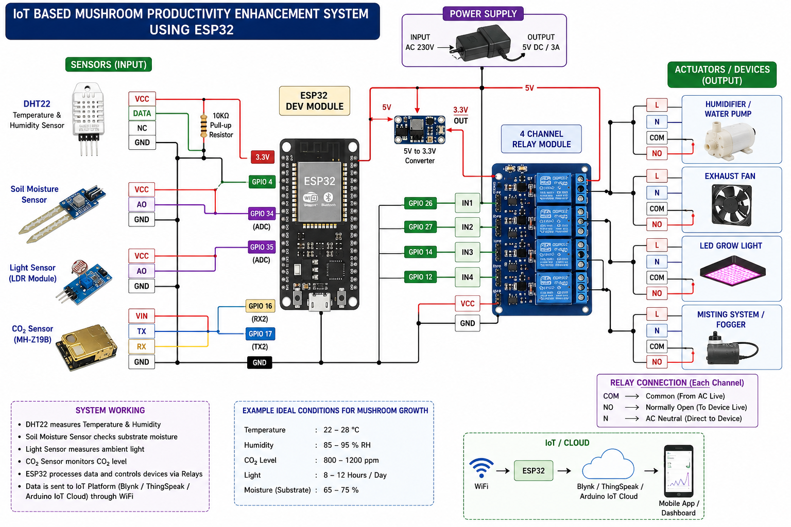

# Smart Mushroom Farming System using ESP32 + IoT + Computer Vision

An AI-powered IoT-based Smart Mushroom Farming System designed to automate and optimize mushroom cultivation using:

- ESP32
- IoT Sensors
- Relay Automation
- Computer Vision
- Cloud Monitoring
- AI Disease Detection

---

# Project Overview

This project continuously monitors and controls the mushroom growing environment.

The system automatically manages:

- Temperature
- Humidity
- CO₂ Levels
- Soil/Substrate Moisture
- Light Intensity

The project also includes:

- Computer Vision Growth Tracking
- AI Disease Detection
- Cloud Dashboard
- Mobile Alerts
- Real-Time Monitoring

---

# Features

## IoT Automation

- Automatic humidifier control
- Smart exhaust fan control
- LED grow light automation
- Live sensor monitoring
- Remote dashboard access

## AI & Computer Vision

- Mushroom growth tracking
- Size estimation
- Disease detection
- Contamination detection
- Harvest prediction

## Cloud Features

- Real-time dashboard
- Firebase / ThingSpeak integration
- Telegram alerts
- Data logging
- Historical analytics

---

# Hardware Components

| Component              | Quantity |
| ---------------------- | -------- |
| ESP32 Dev Board        | 1        |
| DHT22 Sensor           | 1        |
| Soil Moisture Sensor   | 1        |
| LDR Light Sensor       | 1        |
| CO₂ Sensor (MH-Z19B)   | 1        |
| 4 Channel Relay Module | 1        |
| Humidifier / Fogger    | 1        |
| Exhaust Fan            | 1        |
| LED Grow Light         | 1        |
| Water Pump             | 1        |
| 5V Power Supply        | 1        |
| Jumper Wires           | Multiple |

---

# Circuit Connections

---

# 1. DHT22 Temperature & Humidity Sensor

| DHT22 Pin | ESP32 Pin |
| --------- | --------- |
| VCC       | 3.3V      |
| DATA      | GPIO 4    |
| GND       | GND       |

## Important

Add a 10kΩ pull-up resistor between:

- DATA
- VCC

---

# 2. Soil Moisture Sensor

| Sensor Pin | ESP32 Pin |
| ---------- | --------- |
| VCC        | 3.3V      |
| AO         | GPIO 34   |
| GND        | GND       |

---

# 3. LDR Light Sensor

| Sensor Pin | ESP32 Pin |
| ---------- | --------- |
| VCC        | 3.3V      |
| AO         | GPIO 35   |
| GND        | GND       |

---

# 4. CO₂ Sensor (MH-Z19B)

| MH-Z19B Pin | ESP32 Pin |
| ----------- | --------- |
| VIN         | 5V        |
| GND         | GND       |
| TX          | GPIO 16   |
| RX          | GPIO 17   |

---

# 5. Relay Module Connections

| Relay Input | ESP32 GPIO |
| ----------- | ---------- |
| IN1         | GPIO 26    |
| IN2         | GPIO 27    |
| IN3         | GPIO 14    |
| IN4         | GPIO 12    |

| Relay Channel | Device         |
| ------------- | -------------- |
| Relay 1       | Humidifier     |
| Relay 2       | Exhaust Fan    |
| Relay 3       | LED Grow Light |
| Relay 4       | Water Pump     |

---

# Relay Wiring

## AC Side

### COM

Connect to AC Live Wire

### NO (Normally Open)

Connect to Device Live Input

### Neutral

Connect directly to Device Neutral

---

# Power Supply Connections

| Device       | Power          |
| ------------ | -------------- |
| ESP32        | USB / 5V       |
| Relay Module | 5V             |
| Sensors      | 3.3V           |
| Fan          | External Power |
| Humidifier   | External Power |

---

# GPIO Pin Summary

| GPIO    | Function         |
| ------- | ---------------- |
| GPIO 4  | DHT22 DATA       |
| GPIO 34 | Soil Moisture    |
| GPIO 35 | Light Sensor     |
| GPIO 16 | CO₂ TX           |
| GPIO 17 | CO₂ RX           |
| GPIO 26 | Humidifier Relay |
| GPIO 27 | Fan Relay        |
| GPIO 14 | Light Relay      |
| GPIO 12 | Water Pump Relay |

---

# Folder Structure

```text
smart-mushroom-farm/
│
├── esp32_firmware/
├── ai_computer_vision/
├── backend_server/
├── dashboard/
├── mobile_notifications/
├── cloud/
├── docs/
└── README.md
```

---

# Software Requirements

## ESP32 Firmware

Install:

- Arduino IDE
- PlatformIO

## Python Backend

Install Python packages:

```bash
pip install -r requirements.txt
```

## Frontend Dashboard

```bash
npm install
npm start
```

---

# ESP32 Library Installation

Install the following libraries from Arduino Library Manager:

- DHT Sensor Library
- Adafruit Unified Sensor
- WiFi
- HTTPClient
- ArduinoJson

---

# Uploading ESP32 Firmware

## Using PlatformIO

```bash
pio run
pio run --target upload
```

## Using Arduino IDE

1. Select ESP32 Board
2. Select COM Port
3. Upload code

---

# Running Backend Server

```bash
cd backend_server

python app.py
```

Server runs at:

```text
http://localhost:5000
```

---

# Running Computer Vision

## Start Growth Monitoring

```bash
python detect_growth.py
```

## Start Disease Detection

```bash
python disease_detection.py
```

---

# AI Training

Train AI model:

```bash
python train_model.py
```

Dataset folders:

```text
dataset/
├── healthy/
└── contaminated/
```

---

# Recommended Mushroom Growth Conditions

| Parameter   | Ideal Range    |
| ----------- | -------------- |
| Temperature | 22°C – 28°C    |
| Humidity    | 85% – 95%      |
| CO₂ Level   | 800 – 1200 ppm |
| Light       | 8 – 12 Hours   |
| Moisture    | 65% – 75%      |

---

# Automation Logic

## Humidity Control

```cpp
if(humidity < 85)
{
   humidifier ON;
}
```

## Temperature Control

```cpp
if(temp > 28)
{
   fan ON;
}
```

## Light Automation

```cpp
if(light < threshold)
{
   LED ON;
}
```

---

# Cloud Integration

Supported Platforms:

- Blynk
- Firebase
- ThingSpeak
- Arduino IoT Cloud

---

# Mobile Notifications

Supported Alerts:

- Telegram Alerts
- Email Notifications
- Dashboard Notifications

---

# Future Enhancements

- YOLOv8 Mushroom Detection
- Edge AI using Raspberry Pi
- AI Yield Prediction
- MQTT Protocol
- Thermal Imaging
- Automatic Harvesting Robot
- Smart Irrigation
- AI Contamination Analysis

---

# Safety Notes

## Important

- Use isolated relay modules
- Avoid direct AC contact
- Use proper grounding
- Keep sensors away from water leakage
- Use stable power supply

---

# License

MIT License

---

# Author

Shiam Singh
Smart Mushroom Farming Research Project
